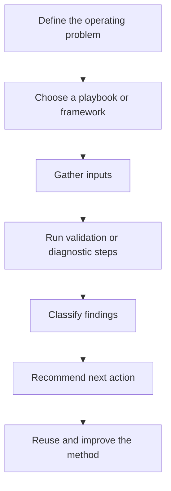

# Marketing Ops Playbooks

A structured set of repeatable playbooks for common marketing operations problems: taxonomy governance, data validation, funnel QA, and performance diagnostics.

These playbooks turn recurring marketing operations work into documented, repeatable methods that can be taught, audited, and automated.

## Why this exists

Marketing operations breaks down when critical knowledge lives only in people's heads.

Taxonomies drift. Funnel math gets inconsistent. Data quality issues hide inside reports. Performance problems get diagnosed through instinct instead of a shared framework.

These playbooks encode repeatable methods for the work that matters most: making sure the data is right, the taxonomy is clean, the funnel math checks out, and diagnostic thinking follows a system.

They are designed to reduce variability across teams and improve consistency at scale.

## Operating model

## What each playbook should provide

Each playbook is designed to be:

- **Documented** — clear methodology, not just code
- **Executable** — validation scripts or repeatable workflows where useful
- **Opinionated** — grounded in operating experience, not generic advice
- **Auditable** — clear enough for another operator to review or improve
- **Reusable** — structured so the method can be applied again

## Skills

| Skill | What it does |
|---|---|
| [UTM Taxonomy Validator](skills/utm-taxonomy-validator/) | Validates UTM parameters against a controlled vocabulary before they propagate through the reporting stack |
| [Funnel Data Validator](skills/funnel-data-validator/) | Applies three-tier validation to conversion funnel data: structural, schema, and cross-source integrity |
| [Data Sanity Checker](skills/data-sanity-checker/) | Runs pre-flight data quality checks before analysis or reporting, catching nulls, duplicates, drift, and anomalies |
| [Negative Keyword Builder](skills/negative-keyword-builder/) | Classifies search terms and supports negative keyword strategy from Google Ads query reports |
| [Performance Media Diagnostics](skills/performance-media-diagnostics/) | Provides a diagnostic framework for isolating paid media performance issues from measurement, product, and market problems |

## Frameworks

Strategic planning templates for recurring marketing operations work:

| Framework | Purpose |
|---|---|
| [CRO Test Planning](frameworks/cro-test-planning.md) | Phased conversion-rate optimization roadmap with hypothesis structure and success criteria |
| [LTV/CAC Audit](frameworks/ltv-cac-audit.md) | Methodology for auditing unit economics models, formula integrity, data completeness, and anomaly detection |
| [Competitive Analysis](frameworks/competitive-analysis.md) | Framework for assessing competitor positioning, messaging, and conversion architecture |

## How to use this repo

Start with the problem you are trying to diagnose.

- Use a **skill** when the problem is data, taxonomy, campaign hygiene, or validation.
- Use a **framework** when the problem is strategic, cross-functional, or decision-oriented.
- Use the script only after the methodology is clear.
- Treat outputs as evidence for a decision, not as the decision itself.

## Example output

See [`examples/example-output.md`](examples/example-output.md) for mock validator outputs showing UTM taxonomy findings, funnel-data checks, severity levels, and recommended fixes.

## Related repos

This repo is part of a connected public system. See the [GitHub Ecosystem Map](https://github.com/silvermanjared-web/growth-architecture-os/blob/main/docs/ecosystem-map.md) for how the repos relate.

Shared terminology: [Common Language](https://github.com/silvermanjared-web/growth-architecture-os/blob/main/docs/common-language.md).

Usage and rights: see [USAGE.md](USAGE.md).

- [`growth-architecture-os`](https://github.com/silvermanjared-web/growth-architecture-os)
- [`marketing-ops-toolkit`](https://github.com/silvermanjared-web/marketing-ops-toolkit)
- [`marketing-intelligence-agent`](https://github.com/silvermanjared-web/marketing-intelligence-agent)

## Design philosophy

- **Methodology first, code second** — the README explains the thinking; the script automates the execution
- **Controlled vocabulary** — marketing data breaks when naming is ad hoc; these tools enforce structure
- **Three tiers of validation** — structural integrity, schema logic, and cross-source reconciliation
- **Diagnostic trees, not checklists** — problems have root causes; frameworks should help find them, not just list symptoms
- **Reusable operating knowledge** — the best marketing operations work should not need to be rediscovered every quarter

## What this demonstrates

This repo shows how marketing operations judgment can be converted into practical, reusable systems: documented methods, validation scripts, diagnostic frameworks, and structured playbooks that improve consistency across complex growth work.