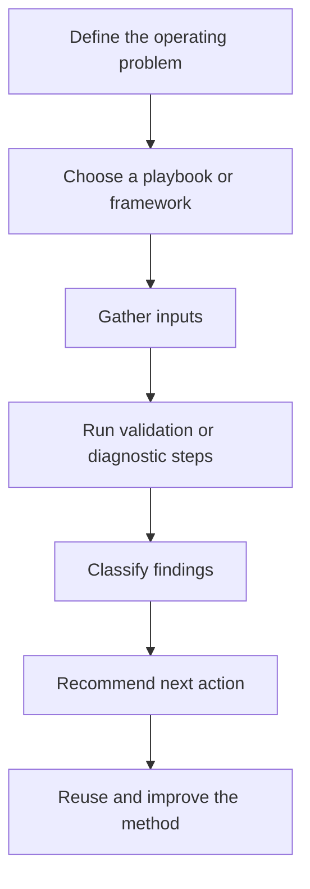

# Marketing Ops Playbooks

A structured set of repeatable playbooks for common marketing operations problems: taxonomy governance, data validation, funnel QA, and performance diagnostics.

These playbooks turn recurring marketing operations work into documented, repeatable methods that can be taught, audited, and automated.

The connective operating model is the **Full-Cycle Growth Loop**: **Brief → Plan → Execute → Test & Learn → Report & Diagnose → Feed Learning Forward → Better Brief**. The point is not to install a cookie-cutter process. The loop stays stable while the mechanics adapt to each organization's goals, maturity, channels, data, teams, and constraints.

## Why this exists

Marketing operations breaks down when critical knowledge lives only in people's heads.

Taxonomies drift. Funnel math gets inconsistent. Data quality issues hide inside reports. Performance problems get diagnosed through instinct instead of a shared framework.

These playbooks encode repeatable methods for the work that matters most: making sure the data is right, the taxonomy is clean, the funnel math checks out, and diagnostic thinking follows a system.

They are designed to reduce variability across teams and improve consistency at scale.

## Operating model

The repository now has two complementary loops.

### Full-cycle growth loop

```mermaid
flowchart LR
    Brief[Brief] --> Plan[Plan]
    Plan --> Execute[Execute]
    Execute --> Test[Test & Learn]
    Test --> Report[Report & Diagnose]
    Report --> Learn[Feed Learning Forward]
    Learn --> Brief
```

This is the strategic operating cycle: every execution cycle should improve the assumptions and decisions in the next one.

See [Full-Cycle Growth Loop](frameworks/full-cycle-growth-loop.md) and the [Full-Cycle Learning Brief](templates/full-cycle-learning-brief.md).

### Playbook execution loop

```mermaid
flowchart TD
    Problem[Define the operating problem] --> Method[Choose a playbook or framework]
    Method --> Inputs[Gather inputs]
    Inputs --> Validate[Run validation or diagnostic steps]
    Validate --> Findings[Classify findings]
    Findings --> Decision[Recommend next action]
    Decision --> Repeat[Reuse and improve the method]
```

The execution loop governs an individual diagnostic or method. The full-cycle loop connects those methods into an ongoing growth system.

## What each playbook should provide

Each playbook is designed to be:

- **Documented** — clear methodology, not just code
- **Executable** — validation scripts or repeatable workflows where useful
- **Opinionated** — grounded in operating experience, not generic advice
- **Auditable** — clear enough for another operator to review or improve
- **Reusable** — structured so the method can be applied again

## Skills

| Skill | What it does |
|---|---|
| [UTM Taxonomy Validator](skills/utm-taxonomy-validator/) | Validates UTM parameters against a controlled vocabulary before they propagate through the reporting stack |
| [Funnel Data Validator](skills/funnel-data-validator/) | Applies three-tier validation to conversion funnel data: structural, schema, and cross-source integrity |
| [Data Sanity Checker](skills/data-sanity-checker/) | Runs pre-flight data quality checks before analysis or reporting, catching nulls, duplicates, drift, and anomalies |
| [Negative Keyword Builder](skills/negative-keyword-builder/) | Classifies search terms and supports negative keyword strategy from Google Ads query reports |
| [Performance Media Diagnostics](skills/performance-media-diagnostics/) | Provides a diagnostic framework for isolating paid media performance issues from measurement, product, and market problems |

## Frameworks

Strategic planning templates for recurring marketing operations work:

| Framework | Purpose |
|---|---|
| [CRO Test Planning](frameworks/cro-test-planning.md) | Phased conversion-rate optimization roadmap with hypothesis structure and success criteria |
| [LTV/CAC Audit](frameworks/ltv-cac-audit.md) | Methodology for auditing unit economics models, formula integrity, data completeness, and anomaly detection |
| [Competitive Analysis](frameworks/competitive-analysis.md) | Framework for assessing competitor positioning, messaging, and conversion architecture |
| [Full-Cycle Growth Loop](frameworks/full-cycle-growth-loop.md) | End-to-end operating model connecting brief, plan, execution, testing, reporting, diagnosis, and feed-forward learning |

## The compounding principle

A linear campaign process ends with reporting. A growth operating system feeds what was learned back into the next brief and plan.

That means reporting is not the finish line. It is the bridge into the next planning cycle.

The framework has remained useful across very different organizations because the **principles are repeatable while the implementation is adaptable**. Channel mix, cadence, teams, tools, measurement maturity, and approval models can change. The learning loop does not.

Over time, that creates compounding operating knowledge: stronger briefs, sharper allocation, better tests, cleaner execution, and faster diagnosis.

## How to use this repo

Start with the problem you are trying to diagnose.

- Use a **skill** when the problem is data, taxonomy, campaign hygiene, or validation.
- Use a **framework** when the problem is strategic, cross-functional, or decision-oriented.
- Use the script only after the methodology is clear.
- Treat outputs as evidence for a decision, not as the decision itself.

## Example output

See [`examples/example-output.md`](examples/example-output.md) for mock validator outputs showing UTM taxonomy findings, funnel-data checks, severity levels, and recommended fixes.

## AI operating-system relationship

These playbooks define repeatable methods that can be exposed as capabilities without turning every method into an autonomous mutation.

The canonical [AI Operating System Reference](https://github.com/silvermanjared-web/growth-architecture-os/tree/main/04-ai-systems/ai-operating-system-reference) explains the shared pattern: context, explicit capabilities, bounded execution, receipts, and human authority.

`marketing-intelligence-agent` applies that pattern to synthesis and routing. `marketing-ops-toolkit` applies it to deterministic execution and bounded mutation. This repository remains the methodology layer underneath both.

## Related repos

This repo is part of a connected public system. See the [GitHub Ecosystem Map](https://github.com/silvermanjared-web/growth-architecture-os/blob/main/docs/ecosystem-map.md) for how the repos relate.

This repository codifies repeatable operating methods and review standards. The [`private-to-public-release-gate`](https://github.com/silvermanjared-web/private-to-public-release-gate) is the companion publication control: it makes the decision to export, exclude, sanitize, or overlay private-derived material explicit before public release. The playbooks define how work should run; the gate demonstrates how selected private patterns can cross into the public portfolio safely.

Shared terminology: [Common Language](https://github.com/silvermanjared-web/growth-architecture-os/blob/main/docs/common-language.md).

Usage and rights: see [USAGE.md](USAGE.md).

- [`growth-architecture-os`](https://github.com/silvermanjared-web/growth-architecture-os)
- [`marketing-ops-toolkit`](https://github.com/silvermanjared-web/marketing-ops-toolkit)
- [`marketing-intelligence-agent`](https://github.com/silvermanjared-web/marketing-intelligence-agent)
- [`private-to-public-release-gate`](https://github.com/silvermanjared-web/private-to-public-release-gate)

## Design philosophy

- **Methodology first, code second** — the README explains the thinking; the script automates the execution
- **Controlled vocabulary** — marketing data breaks when naming is ad hoc; these tools enforce structure
- **Three tiers of validation** — structural integrity, schema logic, and cross-source reconciliation
- **Diagnostic trees, not checklists** — problems have root causes; frameworks should help find them, not just list symptoms
- **Reusable operating knowledge** — the best marketing operations work should not need to be rediscovered every quarter

## What this demonstrates

This repo shows how marketing operations judgment can be converted into practical, reusable systems: documented methods, validation scripts, diagnostic frameworks, and structured playbooks that improve consistency across complex growth work.

Part of the [Jared Silverman growth portfolio](https://github.com/silvermanjared-web) — see also [Marketing Ops Toolkit](https://github.com/silvermanjared-web/marketing-ops-toolkit) for the executable automation layer.
