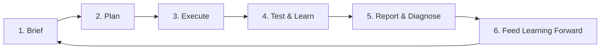

# Full-Cycle Growth Loop

## The operating idea

Growth planning should not be a linear handoff from strategy to media to reporting.

It should be a learning system.

The operating cycle is:

**Brief → Plan → Execute → Test & Learn → Report & Diagnose → Feed Learning Forward → Better Brief**

Each cycle should improve the assumptions, allocation logic, audience strategy, creative direction, measurement plan, and operating decisions in the next cycle.

This is a foundational operating pattern I have used and adapted across organizations since enterprise omnichannel planning work in the mid-2010s. The framework is deliberately stable; the implementation is not. Each organization has different decision rights, data maturity, channel mix, planning cadence, technology, and commercial constraints.

The goal is therefore not to install a cookie-cutter process. It is to preserve the learning loop while adapting the mechanics to the organization.

## The loop



## 1. Brief

The brief defines the business problem before the channel solution.

A useful brief establishes:

- business objective;
- audience and demand context;
- commercial or funnel constraint;
- baseline performance;
- success measures;
- known assumptions;
- measurement limitations;
- budget and timing constraints;
- decisions the work is expected to inform.

### Output

A decision-ready problem definition rather than a channel shopping list.

## 2. Plan

The plan translates the brief into an investment and learning strategy.

It should define:

- role of each channel;
- audience architecture;
- funnel coverage;
- budget allocation;
- creative and landing-page requirements;
- measurement design;
- test hypotheses;
- decision thresholds;
- operating cadence;
- owners and dependencies.

The plan is a hypothesis about how the system will create growth. It is not a permanent commitment to the original allocation.

### Output

An executable media and growth plan with explicit assumptions.

## 3. Execute

Execution makes the plan real while preserving the measurement and learning architecture established upstream.

Execution includes:

- campaign and platform implementation;
- taxonomy and naming;
- audience deployment;
- creative and landing-page handoff;
- conversion instrumentation;
- QA;
- pacing;
- partner and agency coordination;
- issue escalation.

### Output

A controlled implementation whose results can actually be interpreted.

## 4. Test & Learn

Testing is part of the plan, not an activity added after launch.

Tests should resolve uncertainty that matters to future decisions.

Examples:

- channel incrementality;
- audience strategy;
- creative proposition;
- landing-page architecture;
- bid or budget strategy;
- geographic allocation;
- lead-quality tradeoffs;
- upper-funnel contribution;
- measurement assumptions.

A test is useful when its result changes what the organization will do.

### Output

Evidence that confirms, rejects, or changes an operating assumption.

## 5. Report & Diagnose

Reporting should explain the system, not merely describe platform metrics.

The reporting layer asks:

- What happened?
- Why did it happen?
- Is the signal trustworthy?
- What changed downstream?
- What did the tests teach us?
- Where is performance constrained?
- What decision should change?

Diagnosis should distinguish media problems from measurement, product, funnel, market, creative, operational, and infrastructure problems.

### Output

A decision, an owner, a learning, or a clearly named information gap.

## 6. Feed Learning Forward

This is the step that turns campaign management into a growth operating system.

Learning from the cycle is fed back into:

- the next brief;
- planning assumptions;
- audience definitions;
- budget allocation;
- channel roles;
- creative direction;
- CRO priorities;
- measurement requirements;
- agency scopes;
- test roadmap;
- executive expectations.

The next cycle should therefore begin smarter than the previous one.

### Output

An improved operating baseline.

## Why the loop compounds

A linear workflow ends with a report.

A learning loop ends with a better starting point.

Over multiple cycles:

```text
Cycle 1: assumptions → evidence
Cycle 2: better assumptions → stronger allocation
Cycle 3: stronger allocation → sharper tests
Cycle 4: sharper tests → better operating knowledge
Cycle N: accumulated learning → structural advantage
```

Innovation is not a separate workshop inside this model. It emerges because the system continuously turns evidence into changed behavior.

## What remains fixed vs. adaptable

### Fixed

- business objective before channel tactics;
- explicit assumptions;
- measurement designed before execution;
- testing tied to decisions;
- reporting tied to diagnosis;
- learning fed into the next planning cycle.

### Adaptable

- planning cadence;
- channel mix;
- test methodology;
- team and agency roles;
- approval model;
- reporting format;
- data architecture;
- tooling;
- automation;
- AI involvement.

This distinction matters. The framework should survive organizational differences without forcing every organization into the same process.

## AI-enabled version

AI can compress the cycle without owning the business judgment.

Useful AI roles include:

- converting source context into structured briefs;
- identifying missing assumptions;
- comparing plan against brief;
- QA of taxonomy and measurement;
- monitoring performance signals;
- synthesizing test results;
- drafting diagnostic readouts;
- retrieving prior learning before the next brief;
- routing repeatable work through bounded capabilities.

The [AI Operating System Reference](https://github.com/silvermanjared-web/growth-architecture-os/tree/main/04-ai-systems/ai-operating-system-reference) describes the architecture for doing this without granting unconstrained authority.

## Connections to this repository

The existing playbooks plug into different points in the loop:

| Loop stage | Supporting playbooks |
|---|---|
| Brief | Competitive Analysis, LTV/CAC Audit |
| Plan | CRO Test Planning, Performance Media Diagnostics |
| Execute | UTM Taxonomy Validator, Data Sanity Checker |
| Test & Learn | CRO Test Planning, Funnel Data Validator |
| Report & Diagnose | Performance Media Diagnostics, Funnel Data Validator, LTV/CAC Audit |
| Feed Learning Forward | All outputs become inputs to the next brief and plan |

The loop is therefore the connective operating model around the repository's existing skills and frameworks, not a replacement for them.

## Standard

Every meaningful reporting cycle should improve at least one future decision.

If the organization produces reports but the next brief, plan, allocation, test, or operating assumption remains unchanged despite new evidence, the learning loop is incomplete.
